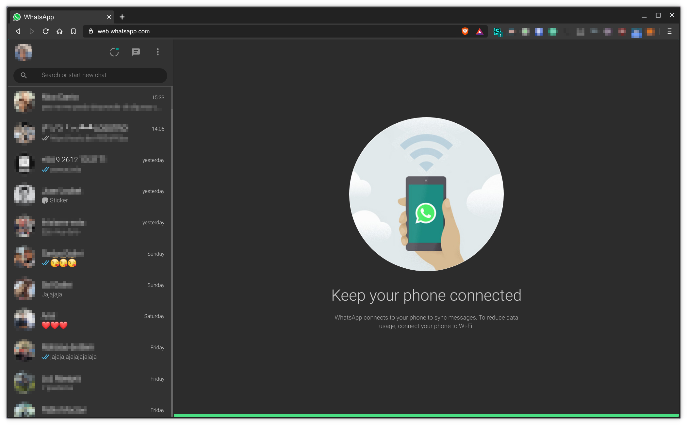
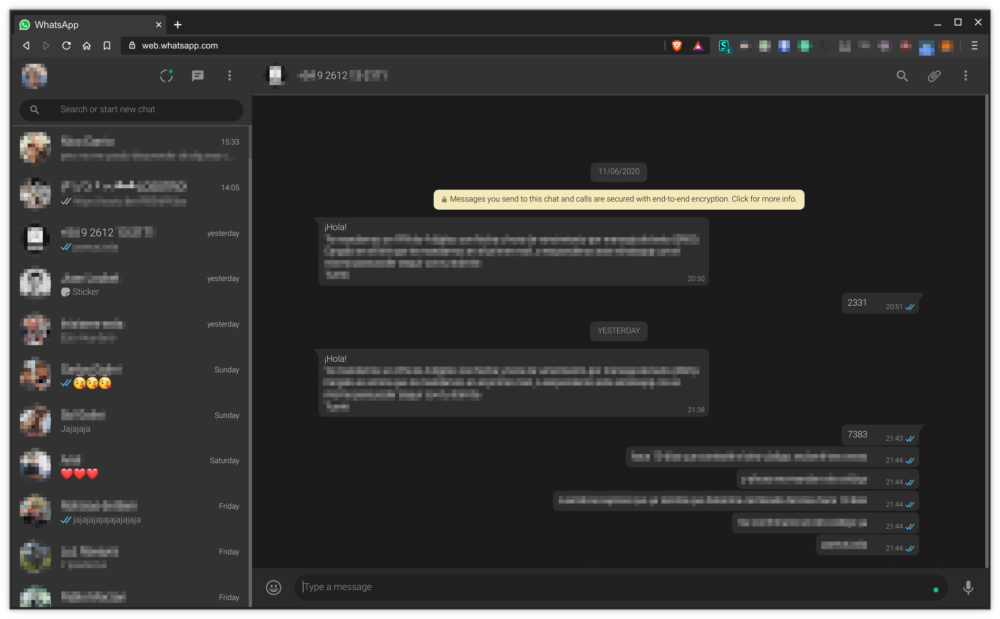

# WhatsApp Dark

WhatsApp dark is a simple dark style for WhatsApp Web.

## Preview

## Installation

Install [Stylus](https://add0n.com/stylus.html) for either 
[Firefox](https://addons.mozilla.org/en-US/firefox/addon/styl-us/), 
[Chrome/Chromium/Brave/Vivaldi](https://chrome.google.com/webstore/detail/stylus/clngdbkpkpeebahjckkjfobafhncgmne) or 
[Opera](https://addons.opera.com/en-gb/extensions/details/stylus/) or 
[Cascadea for Safari](https://cascadea.app/) and then:

[Install the CSS](https://raw.githubusercontent.com/SpartanJ/whatsapp-dark/master/whatsapp-dark.css)
which supports automatic updates.

## Notes

This is a mirror of my style [WhatsApp Dark Theme by Prognoz](https://userstyles.org/styles/142914/)
hosted in [userstyles.org](https://userstyles.org). And this repository will now be the official
place to distribute the style, since userstyles is basically dead.

Also, the CSS is a monstruosity but it works. WhatsApp Web thankfully started using 
[CSS custom properties](https://developer.mozilla.org/en-US/docs/Web/CSS/--*) some time ago, but
almost all the old code is still in in the CSS, so many rules are just old code, I'm to lazy to
clean up that mess for the moment.

## License

[CC0 - Public Domain](https://creativecommons.org/share-your-work/public-domain/cc0/)
